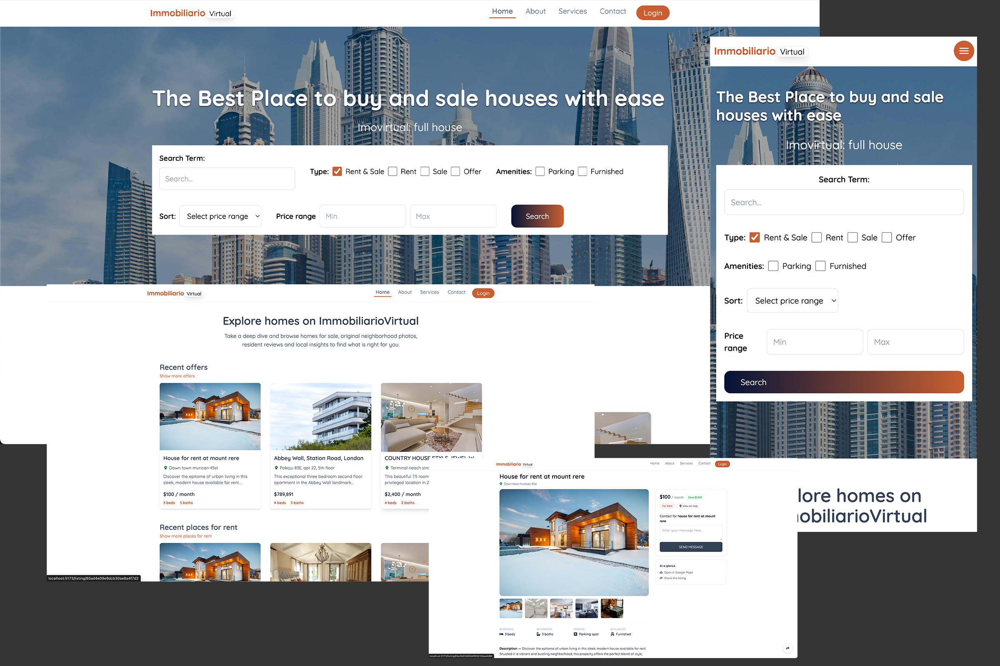

# Immobilia-Virtual

Modern, responsive real-estate web app for the Polish market. Search, filter, and explore listings; subscribe to market insights; contact trusted pros; and sign in with Google OAuth.



<p align="left">
  <a href="https://developer.mozilla.org/docs/Web/Guide/HTML/HTML5">HTML5</a> ·
  <a href="https://tailwindcss.com/">Tailwind CSS</a> ·
  <a href="https://react.dev/">React</a> ·
  <a href="https://nodejs.org/">Node.js</a> ·
  <a href="https://expressjs.com/">Express</a> ·
  <a href="https://www.mongodb.com/">MongoDB</a> ·
  <a href="https://firebase.google.com/docs/auth">Firebase Auth (Google OAuth)</a> ·
  <a href="https://flowbite.com/">Flowbite</a>
</p>

---

## Table of Contents
- [Features](#features)
- [Tech Stack](#tech-stack)
- [Project Structure](#project-structure)
- [Getting Started](#getting-started)
  - [Prerequisites](#prerequisites)
  - [Environment Variables](#environment-variables)
  - [Install & Run](#install--run)
- [Frontend](#frontend)
  - [Routing](#routing)
  - [Styling & Components](#styling--components)
  - [Google OAuth (Firebase)](#google-oauth-firebase)
  - [Advanced Search](#advanced-search)
- [Backend](#backend)
  - [REST Endpoints](#rest-endpoints)
  - [Data Models](#data-models)
- [Accessibility & UX](#accessibility--ux)
- [Security & Privacy](#security--privacy)
- [Deployment](#deployment)
- [Troubleshooting](#troubleshooting)
- [Roadmap](#roadmap)
- [License](#license)

---

## Features

-  **Google OAuth login** (Firebase Authentication); user avatar displayed in header.
-  **Advanced search** with URL-synced filters (type, amenities, price range, sort) and “Show more” pagination.
-  **Newsletter subscription** component (reusable on Home/About) with validation, consent, honeypot, and async status.
-  **Contact form** posts to `/api/contact` with server-side validation and optional email notifications.
-  **Modern navigation** with active states (`NavLink`) and a responsive mobile drawer.
-  **Marketing pages**: About & Services (responsive, accessible, brand-consistent).
-  **Tailwind + Flowbite UI** with gradient accents and a sticky filter sidebar on desktop.
-  **Redux toolkits** For state management.

---

## Tech Stack

**Frontend:** HTML5, JavaScript, React, Tailwind CSS, Flowbite  
**Backend:** Node.js, Express  
**Database:** MongoDB (+ Mongoose)  
**Auth:** Firebase Authentication (Google OAuth)  
**Email (optional):** Nodemailer/SMTP

---

## Project Structure

```text
immobilia-virtual/
├─ api/
│  ├─ index.js                     # Express app entry (ESM)
│  ├─ routes/
│  │  ├─ contact.routes.js         # POST /api/contact
│  │  └─ newsletter.routes.js      # (optional) POST /api/newsletter
│  ├─ controllers/
│  │  ├─ contact.controller.js     # createContact()
│  │  └─ newsletter.controller.js  # (optional)
│  └─ models/
│     ├─ ContactMessage.js
│     └─ NewsletterSubscriber.js   # (optional)
├─ src/
│  ├─ components/
│  │  ├─ Header.jsx
│  │  ├─ ListingItem.jsx
│  │  ├─ NewsletterSignup.jsx      # reusable signup form (Home/About/modal)
│  │  └─ ...
│  ├─ hooks/
│  │  └─ useMediaQuery.js
│  ├─ pages/
│  │  ├─ Home.jsx
│  │  ├─ Search.jsx
│  │  ├─ AboutImmobiliaVirtual.jsx
│  │  └─ ServicesImmobiliaVirtual.jsx
│  └─ assets/
│     └─ logo22.png
├─ realestate.jpg                  # README preview image
├─ tailwind.config.js
├─ postcss.config.js
├─ package.json
└─ README.md


---

## Getting Started

### Prerequisites
- Node.js ≥ 18
- MongoDB (local or hosted, e.g., Atlas)
- Firebase project (enable Google sign-in)

### Environment Variables

**Backend – `api/.env`** (or project `.env` if you start server from root):
```env
# server
PORT=7500

# mongodb
MONGODB_URI=mongodb://localhost:27017/immobilia
MONGODB_DB=immobilia

# cors
CORS_ORIGIN=http://localhost:5173

# email notifications (optional)
SMTP_HOST=smtp.sendgrid.net
SMTP_PORT=587
SMTP_USER=apikey
SMTP_PASS=YOUR_SENDGRID_API_KEY
MAIL_FROM="Immobilia Virtual <no-reply@yourdomain.com>"
MAIL_TO=hello@immobilia-virtual.com

# API origin (if client & server are separate)
VITE_API_BASE_URL=http://localhost:7500

# Firebase (Google OAuth)
VITE_FIREBASE_API_KEY=YOUR_FIREBASE_API_KEY
VITE_FIREBASE_AUTH_DOMAIN=your-app.firebaseapp.com
VITE_FIREBASE_PROJECT_ID=your-app
VITE_FIREBASE_APP_ID=1:1234567890:web:abcdef
VITE_FIREBASE_MESSAGING_SENDER_ID=1234567890

```
## Getting Started

## Install & Run

Install dependencies:

```bash
npm i

npm i -D nodemon concurrently

npm run dev

